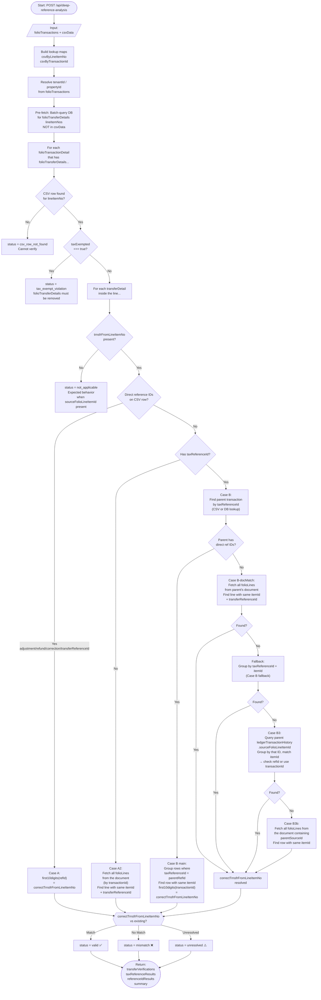
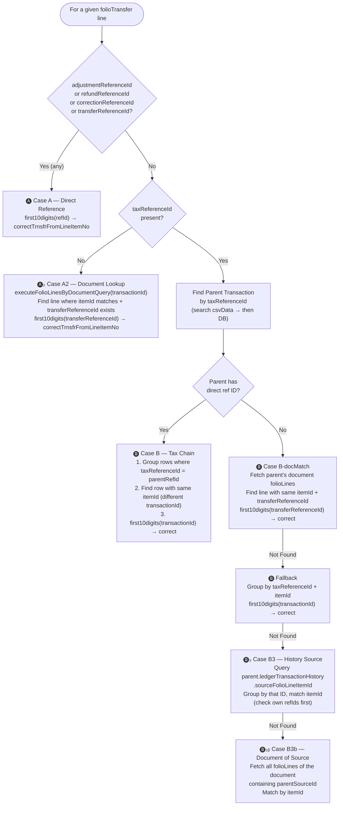
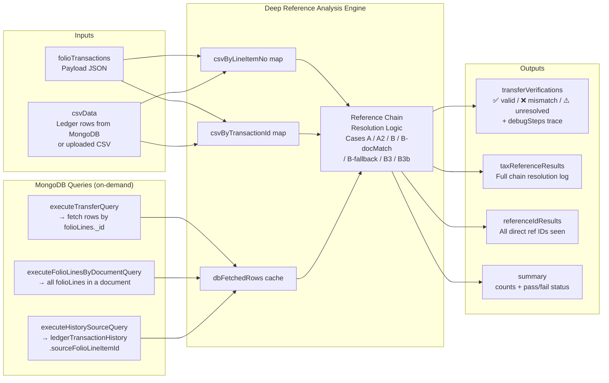

# Deep Reference Analysis — How It Works

**Endpoint:** `POST /api/deep-reference-analysis`  
**Purpose:** Verifies `trnsfrFromLineItemNo` inside every `folioTransferDetails` of the payload by tracing reference chains against MongoDB ledger data.

---

## High-Level Flow

---

## Reference Resolution Cases (Decision Tree)

---

## Data Sources Used

---

## Key Fields Explained

| Field | Source | Description |
|---|---|---|
| `lineItemNo` | Payload | First 10 numeric digits of `transactionId` — used as lookup key |
| `trnsfrFromLineItemNo` | Payload's `folioTransferDetails` | The value being verified |
| `correctTrnsfrFromLineItemNo` | Computed by engine | What the value **should** be, derived from the reference chain |
| `adjustmentReferenceId` | MongoDB `csvData` | Direct pointer → Case A |
| `refundReferenceId` | MongoDB `csvData` | Direct pointer → Case A |
| `correctionReferenceId` | MongoDB `csvData` | Direct pointer → Case A |
| `transferReferenceId` | MongoDB `csvData` | Direct pointer → Case A |
| `taxReferenceId` | MongoDB `csvData` | Pointer to parent transaction → Case B chain |
| `sourceFolioLineItemId` | `ledgerTransactionHistory` | Fallback when no direct refs exist → Cases B3/B3b |
| `itemId` | MongoDB `csvData` | Used to match sibling transactions across grouped rows |

---

## Status Outcomes

| Status | Meaning |
|---|---|
| `valid` ✅ | `trnsfrFromLineItemNo` matches the computed correct value |
| `mismatch` ❌ | `trnsfrFromLineItemNo` is wrong — shows correct value and resolution path |
| `unresolved` ⚠️ | Engine could not determine the correct value (missing data / DB unavailable) |
| `csv_row_not_found` | The payload line does not exist in csvData or DB pre-fetch |
| `tax_exempt_violation` | Line is tax-exempt — `folioTransferDetails` should not exist at all |
| `not_applicable` | `trnsfrFromLineItemNo` is absent — expected behavior when `sourceFolioLineItemId` is present |

